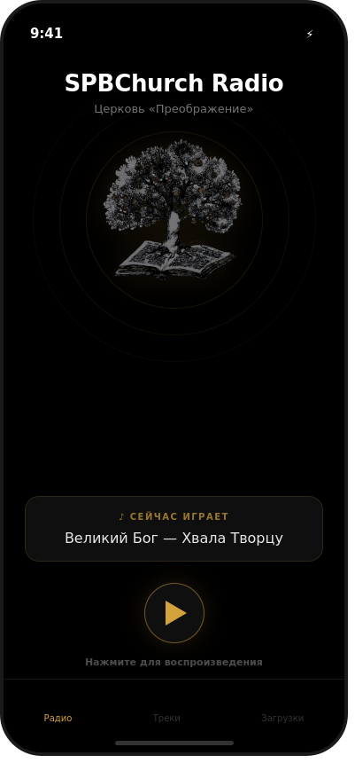
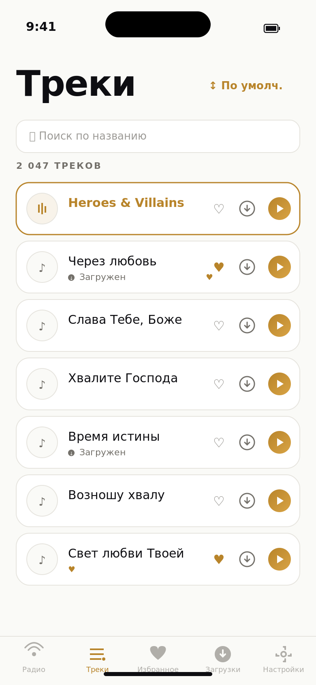
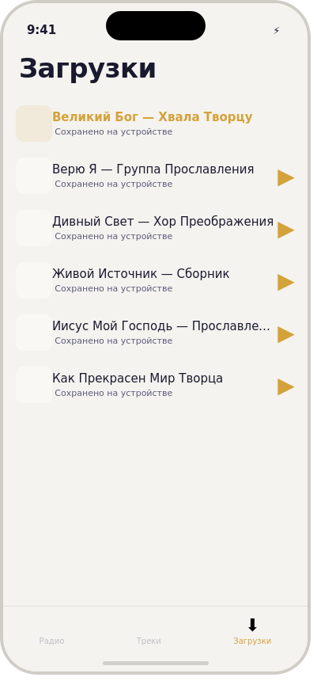

# SPBChurch Radio

iOS-приложение для интернет-радиостанции церкви ЕХБ «Преображение» (Санкт-Петербург).

## Возможности

- **Прямой эфир** — стриминг радиопотока с отображением текущего трека (Icecast)
- **Библиотека треков** — поиск и воспроизведение из каталога 2000+ аудиозаписей
- **Shuffle и навигация** — случайный порядок воспроизведения, кнопки вперёд/назад
- **Офлайн-режим** — загрузка треков для прослушивания без интернета
- **Фоновое воспроизведение** — музыка продолжает играть при сворачивании приложения
- **Буферизация** — 1-минутный буфер для стабильного воспроизведения
- **Управление с Lock Screen** — play/pause/next через системный плеер и наушники
- **Neumorphic UI** — мягкий объёмный дизайн в стиле AirOS: точечный круговой прогресс, iPod click wheel, поднятые карточки с двойными тенями
- **Адаптивный лейаут** — поддержка поворота экрана на iPhone, все ориентации на iPad

## Скриншоты

<p align="center">
  
  &nbsp;&nbsp;
  
  &nbsp;&nbsp;
  
</p>

| Экран | Описание |
|-------|----------|
| **Радио** | Neumorphic плеер с точечным кольцом прогресса, iPod click wheel, frosted artwork |
| **Треки** | Каталог 2000+ треков с neumorphic кнопками, поиском и мини-плеером |
| **Загрузки** | Офлайн-библиотека с объёмными карточками |

## Требования

- iOS 26.0+
- Xcode 17.0+
- Swift 5.0+

## Сборка

1. Откройте `SPBChurchRadio.xcodeproj` в Xcode
2. Выберите целевое устройство или симулятор
3. Нажмите `Cmd + R` для запуска

## Архитектура

- **SwiftUI** — декларативный UI
- **MVVM** — паттерн архитектуры
- **AVFoundation** — аудиовоспроизведение и буферизация
- **MediaPlayer** — интеграция с Now Playing и Remote Commands

## Структура проекта

```
SPBChurchRadio/
├── SPBChurchRadioApp.swift              — точка входа
├── Info.plist                            — конфигурация (background audio)
├── Assets.xcassets/                      — иконка, цвета (P3 gamut)
├── Models/
│   └── Track.swift                       — модель трека
├── Services/
│   ├── RadioStreamService.swift          — стриминг радио, метаданные Icecast
│   ├── FilePlayerService.swift           — воспроизведение MP3, shuffle
│   ├── TrackListService.swift            — парсинг HTML-каталога треков
│   ├── ArtworkService.swift              — извлечение обложек из ID3 тегов MP3
│   └── DownloadManager.swift             — офлайн-кеширование файлов
├── ViewModels/
│   ├── RadioPlayerViewModel.swift        — управление воспроизведением, next/prev
│   ├── TrackListViewModel.swift          — список треков, поиск, фильтрация
│   └── ThemeManager.swift                — управление темой (system/light/dark)
└── Views/
    ├── Theme.swift                       — цветовая палитра spbchurch.ru
    ├── ContentView.swift                 — TabView с мини-плеером
    ├── RadioView.swift                   — экран радио с фоном дерева
    ├── TrackListView.swift               — список треков с обложками
    ├── DownloadsView.swift               — загруженные треки с обложками
    ├── MiniPlayerBar.swift               — мини-плеер с обложкой
    ├── NowPlayingView.swift              — полноэкранный плеер с круговым прогрессом
    ├── ArtworkView.swift                 — компонент отображения обложки
    ├── AnimatedEqualizerView.swift       — анимированный эквалайзер
    └── SettingsView.swift                — настройки (тема, ссылки, о приложении)
```

## Цветовая палитра

Neumorphic палитра в стиле AirOS Music Player с поддержкой Dark Mode:

| Цвет | Light Hex | Dark Hex | Назначение |
|------|-----------|----------|------------|
| Background | `#F0F0F3` | `#1C1C24` | Основной фон (neumorphic base) |
| Surface | `#F2F2F5` | `#26262E` | Карточки, поднятые элементы |
| Shadow Light | `#FFFFFF` | `#FFFFFF` | Светлая тень (верх-лево) |
| Shadow Dark | `#A8ABB5` | `#000000` | Тёмная тень (низ-право) |
| Text Primary | `#1F1F24` | `#F2F2F5` | Основной текст |
| Text Secondary | `#737380` | `#9999A6` | Вторичный текст |
| Accent | `#D4A23A` | `#E8BE5A` | Золотой акцент |

## История изменений

### v3.3.2 — Открытие плеера с экрана радио
- Виджет текущего трека на главном экране радио теперь кликабельный
- По нажатию открывается полноэкранный `NowPlayingView` с текущим треком
- Добавлена иконка `chevron.up` рядом с нотой как визуальная подсказка

### v3.3.1 — Чистая обложка в Now Playing
- Убран размытый «прозрачный» ореол вокруг обложки в `ArtworkViewFrosted`
- Теперь обложка просто обрезается по кругу без блюр-overlay

### v3.3 — Сортировка списка треков
- Добавлено меню сортировки в toolbar вкладки «Треки» (рядом со строкой поиска)
- Варианты: «По умолчанию», «По названию (А–Я)», «По названию (Я–А)»
- Выбор сохраняется в `UserDefaults` между запусками
- Тактильная отдача при смене порядка

### v3.2 — Минимальная версия iOS 26
- Поднята минимальная версия системы до iOS 26.0
- В проекте больше нет fallback-веток для старых версий: устаревшие проверки не нужны
- Все API соответствуют современным практикам iOS 26 (двупараметрический `.onChange`, `GeometryReader`-based gestures, `contentTransition(.symbolEffect)`)

### v3.1.1 — Исправления багов и предупреждений
- **Seek slider** — исправлена перемотка трека: жест теперь использует ширину GeometryReader вместо устаревшего `UIScreen.main.bounds`, корректно работает на iPad и в landscape
- **iOS 17 .onChange** — обновлены устаревшие однопараметрические замыкания на новый двупараметрический формат `{ _, newValue in }` в `AnimatedEqualizerView` и `ContentView`
- **Удалены неиспользуемые объявления** — убран `colorScheme` env из `NeumorphicRaised`, убран unused параметр `row` из `ForEach`, убрана пустая `Button(action: {})` обёртка декоративных точек

### v3.1 — Dark Mode + Эквалайзер + Золотые акценты
- **Dark Mode** — полная адаптивная цветовая палитра, neumorphic тени и фоны для тёмной темы
- **Animated Equalizer** — визуализация аудио: прыгающие полоски эквалайзера при воспроизведении
  - LargeEqualizerView — для заголовка RadioView (7 полос)
  - MiniEqualizerView — для live-индикатора, мини-плеера, строк треков (3–5 полос)
- **Золотые акценты** — акцентный цвет #d4a23a теперь активно используется:
  - Воспроизводимый трек подсвечивается золотым в списках
  - Точки кольцевого прогресса окрашиваются в золотой при воспроизведении
  - Кнопки play/stop выделяются золотым в активном состоянии
  - Прогресс-бар и кольцо прогресса используют золотой градиент
  - Заголовок "SPBChurch" в RadioView — золотой
  - Fallback иконки artwork — золотые вместо серых
- **Seek Slider** — слайдер перемотки на NowPlayingView (drag для перемотки)
- **Blurred Background** — размытая обложка как фон на NowPlayingView
- **Подсветка текущего трека** — золотой фон строки и мини-эквалайзер вместо статичной иконки
- **Haptic Feedback** — тактильная отдача на кнопках play, next/prev, shuffle, download
- **Улучшенный MiniPlayerBar** — статус "Воспроизведение"/"На паузе", эквалайзер на обложке, золотой play
- **Animated Loading** — пульсирующие точки вместо ProgressView при загрузке треков
- **Кнопка удаления** — иконка trash в DownloadsView для удаления загрузок
- **Счётчики** — количество треков в TrackListView, количество загрузок в DownloadsView
- **Кастомный Tab Bar** — tab bar подстраивается под цветовую тему (light/dark)
- **AppGradients** — градиенты для акцентных элементов
- **NeumorphicInset** — новый модификатор для вдавленных элементов
- **Семантические цвета** — AppColors.success и AppColors.error для состояний
- **Экран настроек** — новая вкладка «Настройки»:
  - Выбор темы: системная / светлая / тёмная (сохраняется в UserDefaults)
  - Ссылки на сайт радиостанции (station.spbchurch.ru) и церковь (spbchurch.ru)
  - Описание приложения — полноэкранный экран с информацией о приложении, возможностях и благодарностях
- **ThemeManager** — ObservableObject для управления цветовой схемой приложения через .preferredColorScheme()

### v3.0 — Neumorphic UI (стиль AirOS Music Player)
- Полный редизайн интерфейса в стиле neumorphic/soft UI по референсу Dribbble
- Светлый off-white фон (#F0F0F3) вместо тёмной navy палитры
- Двойные тени (светлая + тёмная) для объёмного эффекта поднятых элементов
- Точечный круговой прогресс-индикатор (36 точек) вместо сплошного кольца
- iPod-style click wheel для управления воспроизведением (rewind/forward/play-pause/menu)
- Frosted glass эффект для artwork (размытие + чёткое изображение по центру)
- Neumorphic карточки-виджеты: Live-индикатор, shuffle, время трека
- Neumorphic кнопки play в списках треков (Circle + двойная тень)
- Монохромная цветовая схема (белый/серый/чёрный)
- Обновлён Theme.swift: NeumorphicRaised и NeumorphicPressed модификаторы
- Обновлены все экраны: RadioView, NowPlayingView, TrackListView, DownloadsView, MiniPlayerBar, ArtworkView

### v2.1 — Исправление Now Playing экрана
- Убран `.ignoresSafeArea()` с корневого контейнера — контент больше не смещается
- Кнопка "свернуть" (chevron.down) всегда видна, включая landscape
- Header вынесен из portrait/landscape в общий layout
- Центровка артворка и контролов через `Spacer()` вместо жёстких отступов
- Увеличена область нажатия кнопок (frame 44x44)

### v2.0 — Обложки треков и экран Now Playing
- Извлечение обложек из ID3 тегов MP3 файлов (AVFoundation)
- Обложки отображаются в списке треков и загрузках
- Полноэкранный Now Playing с большой обложкой и круговым прогрессом
- Размытый фон обложки на экране Now Playing
- Мини-плеер: обложка вместо иконки, tap открывает Now Playing
- Кеширование обложек в памяти (NSCache, до 200 штук)
- Адаптивный landscape-layout для Now Playing

### v1.9 — Исправление парсинга текущего трека
- Парсер брал первый `streamstats` (дата старта потока) вместо трека
- Исправлено: теперь ищет `Currently playing:` и берёт значение после него

### v1.8 — Исправление загрузки треков
- Баг: все треки показывались как «загружено» после скачивания одного
- Причина: base64 хэш URL обрезался до 40 символов — общий префикс
  `https://station.spbchurch.ru/mp3/` давал одинаковый хэш для всех треков
- Исправлено: SHA-256 хэш полного URL (уникальный для каждого трека)
- Убрано неиспользуемое свойство `downloadedTracks` из DownloadManager
- Убрано `Track.isDownloaded` (дублировало логику)

### v1.7 — Исправление экрана радио
- Убрана пульсирующая анимация фона (shadow repeatForever), вызывавшая дёрганье картинки
- Убраны pulse rings — упрощён дизайн
- Opacity фона меняется только при старте/остановке (плавный transition 1 сек)
- Исправлена компоновка portrait: кнопки больше не уходят за экран
- Убраны `.ultraThinMaterial` из карточек (мешали на тёмном фоне) — заменены на `.black.opacity(0.5)`
- Упрощена структура VStack: `Spacer(minLength)` вместо жёстких высот

### v1.6 — Адаптивный лейаут (iPad + поворот экрана)
- iPhone: поддержка portrait + landscape ориентаций
- iPad: все 4 ориентации, увеличенные элементы управления
- RadioView: горизонтальный layout в landscape (название слева, управление справа)
- iPad: увеличенные иконки, шрифты, кнопки, отступы
- MiniPlayerBar: ограничение ширины 600px на iPad
- Pulse rings масштабируются под размер экрана
- Play button адаптивный размер (68px iPhone / 80px iPad)

### v1.5 — Иконка приложения
- Иконка 1024x1024: золотое дерево с корнями на тёмно-синем фоне
- Сгенерирована из artwork с gold tint, glow и виньеткой

### v1.4 — Новая иллюстрация «Древо с корнями»
- Новое artwork: дерево с каллиграфическими корнями
- Исходная светлая картинка обработана: инвертирована, тонирована в navy+gold
- Виньетка по краям, полноэкранное заполнение
- Дерево ярче при воспроизведении (opacity 0.55 → 0.9)

### v1.3 — Фоновая иллюстрация «Древо жизни»
- Картинка дерева из книги как центральный элемент экрана радио
- Золотистое свечение дерева пульсирует при воспроизведении
- Градиентные оверлеи сверху/снизу для читаемости текста
- Пульсирующие кольца вокруг дерева
- Название станции вынесено наверх, управление — вниз
- Убран MeshGradient, чёрный фон картинки = фон экрана

### v1.2 — Shuffle и навигация
- Случайный порядок воспроизведения (включён по умолчанию)
- Авто-переход на следующий трек по окончании
- Кнопки вперёд/назад в мини-плеере и на экране радио
- Поддержка next track с Lock Screen и наушников

### v1.1 — Дизайн iOS 26 + палитра spbchurch.ru
- Liquid Glass эффекты на экране радио
- MeshGradient анимированный фон (iOS 18+)
- Золотые акценты и тёплые бежевые фоны
- NavigationStack, Symbol Effects, hierarchical rendering
- Плавающий стеклянный мини-плеер

### v1.0 — Первый релиз
- Стриминг радиопотока с 1-минутным буфером
- Парсинг текущего трека с Icecast
- Каталог 2000+ треков с поиском
- Загрузка треков для офлайн-прослушивания
- Фоновое воспроизведение и Lock Screen управление
