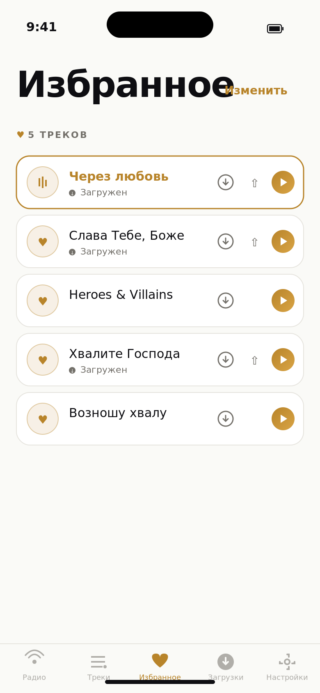
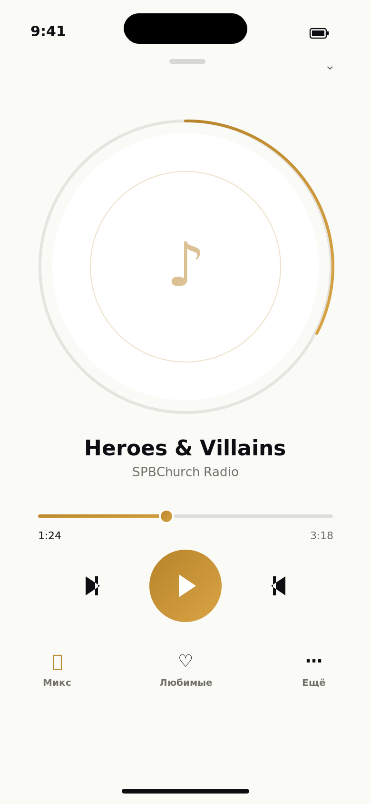
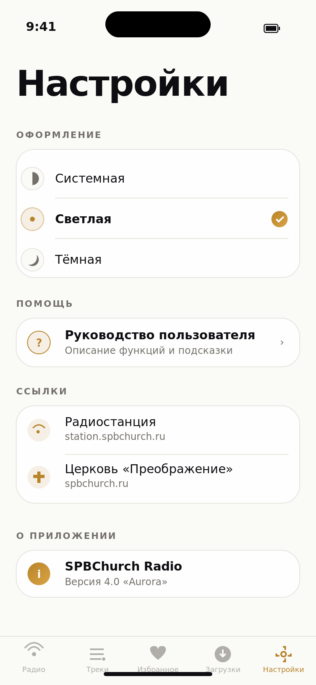
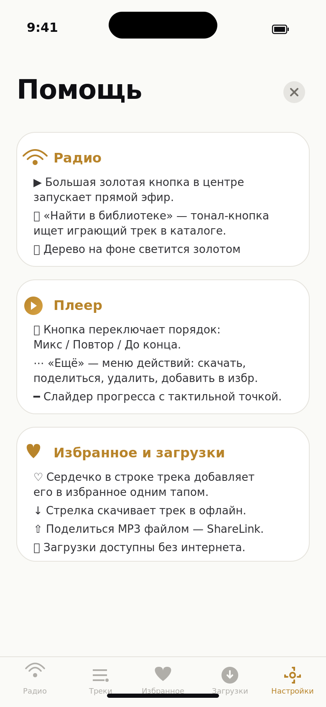

# SPBChurch Radio

iOS-приложение для интернет-радиостанции церкви ЕХБ «Преображение» (Санкт-Петербург).

## Возможности

- **Прямой эфир** — стриминг радиопотока с отображением текущего трека (Icecast)
- **Библиотека треков** — поиск и воспроизведение из каталога 2000+ аудиозаписей
- **Shuffle и навигация** — случайный порядок воспроизведения, кнопки вперёд/назад
- **Офлайн-режим** — загрузка треков для прослушивания без интернета
- **Фоновое воспроизведение** — музыка продолжает играть при сворачивании приложения
- **Буферизация** — 1-минутный буфер для стабильного воспроизведения
- **Управление с Lock Screen** — play/pause/next через системный плеер и наушники
- **Neumorphic UI** — мягкий объёмный дизайн в стиле AirOS: точечный круговой прогресс, iPod click wheel, поднятые карточки с двойными тенями
- **Адаптивный лейаут** — поддержка поворота экрана на iPhone, все ориентации на iPad

## Скриншоты

<p align="center">
  
  &nbsp;
  
  &nbsp;
  
</p>

<p align="center">
  
  &nbsp;
  
  &nbsp;
  
</p>

<p align="center">
  
</p>

| Экран | Описание |
|-------|----------|
| **Радио** | Neumorphic плеер с точечным кольцом прогресса, iPod click wheel, frosted artwork, кнопка «Найти в библиотеке» |
| **Треки** | Каталог 2000+ треков с поиском, сортировкой и neumorphic кнопками воспроизведения |
| **Избранное** | Отдельный плейлист — собственный список любимых треков с drag-reorder и swipe-delete |
| **Плеер** | Полноэкранный Now Playing: точечный прогресс, обложка, seek slider, iPod click wheel, кнопки ♡ и ↓ |
| **Загрузки** | Офлайн-библиотека — доступна даже без интернета благодаря локальному индексу `downloads.json` |
| **Настройки** | Выбор темы (системная / светлая / тёмная), ссылки, помощь, описание |
| **Помощь** | Руководство пользователя — описание всех функций по разделам |

## Требования

- iOS 26.0+
- Xcode 17.0+
- Swift 5.0+

## Сборка

1. Откройте `SPBChurchRadio.xcodeproj` в Xcode
2. Выберите целевое устройство или симулятор
3. Нажмите `Cmd + R` для запуска

## Архитектура

- **SwiftUI** — декларативный UI
- **MVVM** — паттерн архитектуры
- **AVFoundation** — аудиовоспроизведение и буферизация
- **MediaPlayer** — интеграция с Now Playing и Remote Commands

## Структура проекта

```
SPBChurchRadio/
├── SPBChurchRadioApp.swift              — точка входа
├── Info.plist                            — конфигурация (background audio)
├── Assets.xcassets/                      — иконка, цвета (P3 gamut)
├── Models/
│   └── Track.swift                       — модель трека
├── Services/
│   ├── RadioStreamService.swift          — стриминг радио, метаданные Icecast
│   ├── FilePlayerService.swift           — воспроизведение MP3, shuffle
│   ├── TrackListService.swift            — парсинг HTML-каталога треков
│   ├── ArtworkService.swift              — извлечение обложек из ID3 тегов MP3
│   └── DownloadManager.swift             — офлайн-кеширование файлов
├── ViewModels/
│   ├── RadioPlayerViewModel.swift        — управление воспроизведением, next/prev
│   ├── TrackListViewModel.swift          — список треков, поиск, фильтрация
│   └── ThemeManager.swift                — управление темой (system/light/dark)
└── Views/
    ├── Theme.swift                       — цветовая палитра spbchurch.ru
    ├── ContentView.swift                 — TabView с мини-плеером
    ├── RadioView.swift                   — экран радио с фоном дерева
    ├── TrackListView.swift               — список треков с обложками
    ├── DownloadsView.swift               — загруженные треки с обложками
    ├── MiniPlayerBar.swift               — мини-плеер с обложкой
    ├── NowPlayingView.swift              — полноэкранный плеер с круговым прогрессом
    ├── ArtworkView.swift                 — компонент отображения обложки
    ├── AnimatedEqualizerView.swift       — анимированный эквалайзер
    └── SettingsView.swift                — настройки (тема, ссылки, о приложении)
```

## Цветовая палитра «Aurora»

Editorial-glass палитра — нативный iOS-материал, тёплая бронза вместо жёлтого золота, hairline-stroke карточки.

| Цвет | Light | Dark | Назначение |
|------|-------|------|------------|
| Background | `#FAFAF7` | `#0E0E12` | Основной фон |
| Surface | `#FFFFFF` | `#1C1C22` | Карточки |
| Stroke (hairline) | `#E6E4DE` | `#2A2A2E` | Тонкая обводка карточек |
| Text Primary | `#0E0E12` | `#F5F4F0` | Основной текст |
| Text Secondary | `#73706A` | `#9C9890` | Вторичный текст |
| Accent (бронза) | `#B8842A` | `#D9A445` | Главный акцент, заливные CTA |
| Success | `#2E7D5B` | `#4DB081` | Подтверждения |
| Error | `#B33A3A` | `#D95A5A` | Ошибки |

## История изменений

### v4.0.2 — Устранение задержки между загрузками
В v4.0.1 я включил `waitsForConnectivity = true` в URLSessionConfiguration — это оказалось вредно. Флаг заставлял iOS ждать «стабильную сеть» после teardown'а keep-alive сокета от предыдущей загрузки, из-за чего следующее нажатие «Скачать» висело несколько секунд, пока ОС не считала связь готовой.

- **Ephemeral session** вместо `.default` — нет общего кэша, кук и credential storage; каждая загрузка стартует с чистым соединением, не ждёт зависший keep-alive
- Убран `waitsForConnectivity` (default `false`)
- `httpMaximumConnectionsPerHost = 6` (стандартный максимум для ephemeral)
- `Connection: close` в каждом `URLRequest` — сервер закрывает сокет сразу после ответа, OS не держит его в keep-alive пуле
- `cachePolicy = .reloadIgnoringLocalAndRemoteCacheData` на уровне сессии и на каждый запрос — гарантия свежего соединения

### v4.0.1 — Исправление загрузок при дубликатах в каталоге
- **Каталог:** `TrackListService.parseTrackList` теперь дедуплицирует треки по URL — иначе одинаковые `<a href>` в HTML создавали по две `Track` записи с одинаковым URL, что путало логику загрузок (один файл = один хеш = один локальный mp3)
- **DownloadManager.download:** перед стартом проверяет `isDownloaded(track)` — если файл уже есть на диске, синхронизирует state в `.completed` и выходит, ничего не качая повторно
- Кастомный `URLSession` с `httpMaximumConnectionsPerHost = 4`, `waitsForConnectivity = true`, и реалистичными таймаутами (30s request / 600s resource) — параллельные загрузки не упираются в дефолтный лимит
- При отмене (`NSURLErrorCancelled`) state очищается без `.failed` — пользователь не видит «ложно красную ошибку» при своём же нажатии «Отменить»
- Progress observer не перезаписывает терминальные `.completed` / `.failed` если приходит поздно после завершения
- `deleteDownload` теперь корректно отменяет in-flight задачу перед удалением файла — нет гонки между завершением и новым `download()`
- Re-tap по `.failed` строке всегда чистит state и запускает свежую попытку

### v4.0 «Aurora» — Editorial-glass редизайн
Полная визуальная переработка с сохранением функционала.

**Концепция:** уход от тяжёлых neumorphic-теней к нативному iOS-материалу с тонкими hairline-stroke и решительной типографикой. Акцент золота — точечный, для главных CTA.

- **Палитра** обновлена. Light: фон `#FAFAF7` (тёплый off-white), surface чисто белый, hairline `#E6E4DE`, акцент бронзовый `#B8842A` (вместо жёлтого золота). Dark: фон `#0E0E12`, surface `#1C1C22`, акцент `#D9A445`. Полная адаптивность через `Color(light:dark:)`
- **Типографика** — `display(44pt)` для заголовков экранов (`tracking: -1`), мелкие caps с `tracking: 2` для метаданных. Чистый SF Pro без `.rounded`
- **Aurora модификаторы** заменили neumorphic'и: `auroraGlass()` (`.regularMaterial` + hairline + soft drop shadow), `auroraSolid()`, `auroraTonalPill()` (для secondary CTA в акцентном tinted-фоне). Старые `neumorphic*` модификаторы оставлены как shim'ы для совместимости
- **Радио** — solid filled gold play/stop кнопка 144/168pt с glow-shadow в акцентном цвете; типография «Радио / SPBCHURCH» 44pt + 11pt caps; tonal pill «Найти в библиотеке»; маленький status-индикатор «● В ЭФИРЕ»; glass-карточка играющего файла внизу
- **Плеер** — hero artwork 280pt в прозрачном круге с тонким accent-progress ring; крупные transport-кнопки (88pt play в gold-gradient с glow); slider с tactile knob (gold dot + white border); utility row из 3 столбцов (Микс / Любимые / Ещё) с лейблами под иконками. Header минимальный — drag handle + `chevron.down`
- **Списки** (Треки / Избранное / Загрузки) — карточные строки на `.auroraSolid` фоне с hairline, gold-обводка для активного трека, current-status glyph (mini equalizer / pause / heart / checkmark) в круге, accent-circle play-кнопка в правом краю с gold gradient + glow
- **Mini player** — glass-кард, accent-gradient play-кнопка с glow, тонкий progress-line вверху (2pt вместо 3)
- **Tab bar** — translucent через `UIBlurEffect.systemUltraThinMaterial*`, чистый hairline border
- **Контекстные меню** на long-press для Поделиться + Избранное в Треках/Избранном
- **Сохранён весь функционал v3.12**: трёхрежимный порядок воспроизведения, action-меню в плеере, контекстная очередь, офлайн-индекс загрузок, Поделиться через ShareLink, поиск играющего трека
- Новые скриншоты в `screenshots/` соответствуют v4.0

### v3.12 — Большая кнопка эфира, action-меню в плеере, трёхрежимный порядок
- **Кнопка play/stop радио** увеличена в 1.5× (144pt iPhone / 162pt iPad), золотая обводка теперь всегда видна — в покое 35% opacity, в эфире 70%. Иконка стабильно центрирована в круге, не съезжает при смене состояния
- **Фон экрана радио** — дерево рендерится во весь экран как `.background` слой (`GeometryReader` + `aspectRatio(.fill)` + `.clipped()`); при эфире opacity поднимается до 0.75 и поверх ложится золотой `RadialGradient` halo с `.plusLighter` blendMode
- **Layout стабильный** — контент разделён на content + background слои (`.background(backgroundLayer)`), `NavigationStack`-обёртка убрана, `stationHeader` имеет `lineLimit(1) + minimumScaleFactor`. Проверено от iPhone SE (Display Zoom 320×568) до iPhone 16 Pro Max
- **Избранное получило скачивание и share inline**: в `FavoriteTrackRow` добавлена `downloadControl` (те же три состояния, что и в «Треках») и `ShareLink` рядом с heart-кнопкой для уже скачанных треков
- **Трёхрежимный порядок воспроизведения**: кнопка shuffle превратилась в цикл `shuffle → repeatAll → playOnce`:
  - `Микс` — случайный следующий трек из очереди
  - `Повтор` — по порядку, зацикливается после последнего
  - `До конца` — по порядку, останавливается после последнего
  - Сохраняется в `UserDefaults` (`playback_order`). Авто-продвижение (`RadioPlayerViewModel.autoAdvance()`) уважает `.playOnce` и делает stop в конце плейлиста
- **Action-меню в плеере**: вместо виджета времени в `bottomControls.NowPlayingView` теперь `Menu` «Действия» с контекстными пунктами: добавить/убрать из избранного, скачать / отменить / удалить загрузку, поделиться файлом (через `ShareLink` с `SharePreview`). Время трека всё равно видно под seek-slider'ом
- **Header плеера** очищен: убраны heart, download и share — оставлены только заголовок «Музыка», мини-эквалайзер и chevron.down

### v3.11 — Редизайн экрана «Радио»
- Убран iPod click wheel и точечное кольцо вокруг обложки
- Кнопка play/stop теперь одиночный neumorphic круг **над деревом**, а не часть колеса
- Дерево стало центральным визуальным элементом и **светится золотом** когда идёт эфир — двойной `shadow(color: accent, radius: 30/60)` + пульсирующий outer-glow через `RadialGradient` с `scaleEffect` animation (easeInOut 2.2s repeatForever)
- Виджеты снизу переработаны: live-индикатор — отдельная строка, виджет играющего файла показывается только когда активен (раньше всегда занимал место)
- Landscape layout адаптирован под новую структуру

### v3.10 — Поделиться загруженным треком
- В header экрана плеера (`NowPlayingView`) появилась кнопка share (`square.and.arrow.up`), видима только когда трек скачан в офлайн
- Во вкладке «Загрузки» у каждой строки — ShareLink рядом с корзиной
- В `TrackListView` и `FavoritesView` добавлено `contextMenu` (long-press): «Поделиться файлом» (только для скачанных) + управление избранным
- Все share-действия используют стандартный `ShareLink` iOS → обычный share-sheet (AirDrop, Messages, Mail, Files и т.д.) с MP3 файлом и `SharePreview`

### v3.9 — Контекстная очередь воспроизведения и heart в списке треков
- **Фикс:** при воспроизведении из «Избранное» / «Загрузки» проигрывался только один трек — `playNext()` использовал `allTracks` (полный каталог), который без интернета был пуст. Теперь у `RadioPlayerViewModel` есть `@Published var playbackQueue`, который запоминает контекст старта воспроизведения
- `playFile(_:localURL:queue:)` принимает опциональный `queue` — список для `next`/`prev`/автопродвижения
- `activeQueue` предпочитает `playbackQueue`, но падает на `allTracks` как fallback (lock-screen команды после cold start)
- Call sites обновлены:
  - `TrackListView` → `queue: trackListVM.filteredTracks` (учитывает поиск и сортировку)
  - `DownloadsView` → `queue: downloadManager.downloadedTracks`
  - `FavoritesView` → `queue: favoritesManager.favorites`
- В строках вкладки «Треки» (`TrackRow`) появилась heart-кнопка для добавления в избранное прямо из списка, без открытия плеера

### v3.8 — Руководство пользователя и чистое описание
- В настройках появилась секция **«Помощь»** с полноэкранным руководством
- `HelpView` описывает функции по разделам: Радио, Треки, Избранное, Загрузки, Плеер, Фон и управление
- Обновлено описание приложения: убраны упоминания «Церкви Преображение», текст переписан на универсальный — приложение сделано христианами, которым близки псалмы и духовные песни
- Версия в about-экранах поднята до 3.8
- Кнопка загрузки трека добавлена на экран плеера (`NowPlayingView.downloadButton`) с тремя состояниями: скачать / идёт загрузка / загружено

### v3.7 — Избранное как отдельный плейлист
- Новый `FavoritesManager` — сервис управления избранными треками с персистентностью в `Documents/favorites.json`
- Новая вкладка **«Избранное»** (сердечко) в таб-баре: собственный список треков, независимый от каталога и загрузок
- На экране плеера (`NowPlayingView`) в header появилась heart-кнопка: добавляет/удаляет текущий трек из избранного, с анимацией `symbolEffect(.bounce)`
- `FavoritesView` поддерживает swipe-to-delete, reorder (через `EditButton` в toolbar) и показывает статус загрузки трека
- Тап на трек в избранном — play/pause, как и в других списках
- Порядок табов: Радио / Треки / Избранное / Загрузки / Настройки (обновлён `AppNavigator.Tab`)

### v3.6 — Поиск играющего трека в библиотеке
- На экране радио под названием текущего трека появилась кнопка «Найти в библиотеке»
- По нажатию приложение переключается на вкладку «Треки» и автоматически подставляет название играющего трека в поиск
- Ветка `RadioTitle.cleaned()` удаляет бренд-шум («SPBChurch Radio», «Церковь Преображение» и варианты) и обрезает висящие разделители, оставляя чистое название
- Кнопка скрыта, если в метаданных нет осмысленного названия (`Нет данных`, пустое значение)
- Новый `AppNavigator` шарит выбранный таб между `ContentView` и `RadioView` — базовая инфраструктура для кросс-таб навигации

### v3.5 — Офлайн-доступ к уже скачанным трекам
- `DownloadManager` теперь ведёт локальный индекс скачанных треков в `OfflineTracks/downloads.json`
- Вкладка «Загрузки» больше не зависит от загрузки каталога с сервера: ранее скачанные файлы доступны сразу при старте, даже без интернета
- При появлении сети и загрузке каталога старые скачивания без метаданных автоматически регистрируются через `backfillMetadata(from:)` (одноразовая миграция для пользователей, скачавших треки в v3.4 и раньше)
- Удаление трека корректно чистит метаданные

### v3.4.1 — Производительность списка треков
- Убрана загрузка обложек (`ArtworkView`) из списка во вкладке «Треки» — список из 2000+ позиций больше не лагает при прокрутке
- Вместо обложки в строке трека показывается neumorphic-плитка с иконкой ноты
- Обложки **остаются** во всех других местах: `DownloadsView`, `MiniPlayerBar`, `NowPlayingView` (там это не упирается в производительность)

### v3.4 — Современная типографика
- Убрана округлая семейка SF Rounded (`design: .rounded`) во всех экранах
- Теперь используется системный SF Pro Display/Text — чёткий геометрический sans-serif в духе референса AirOS
- Заменено в 42 местах в 6 файлах: RadioView, NowPlayingView, TrackListView, DownloadsView, MiniPlayerBar, SettingsView

### v3.3.2 — Открытие плеера с экрана радио
- Виджет текущего трека на главном экране радио теперь кликабельный
- По нажатию открывается полноэкранный `NowPlayingView` с текущим треком
- Добавлена иконка `chevron.up` рядом с нотой как визуальная подсказка

### v3.3.1 — Чистая обложка в Now Playing
- Убран размытый «прозрачный» ореол вокруг обложки в `ArtworkViewFrosted`
- Теперь обложка просто обрезается по кругу без блюр-overlay

### v3.3 — Сортировка списка треков
- Добавлено меню сортировки в toolbar вкладки «Треки» (рядом со строкой поиска)
- Варианты: «По умолчанию», «По названию (А–Я)», «По названию (Я–А)»
- Выбор сохраняется в `UserDefaults` между запусками
- Тактильная отдача при смене порядка

### v3.2 — Минимальная версия iOS 26
- Поднята минимальная версия системы до iOS 26.0
- В проекте больше нет fallback-веток для старых версий: устаревшие проверки не нужны
- Все API соответствуют современным практикам iOS 26 (двупараметрический `.onChange`, `GeometryReader`-based gestures, `contentTransition(.symbolEffect)`)

### v3.1.1 — Исправления багов и предупреждений
- **Seek slider** — исправлена перемотка трека: жест теперь использует ширину GeometryReader вместо устаревшего `UIScreen.main.bounds`, корректно работает на iPad и в landscape
- **iOS 17 .onChange** — обновлены устаревшие однопараметрические замыкания на новый двупараметрический формат `{ _, newValue in }` в `AnimatedEqualizerView` и `ContentView`
- **Удалены неиспользуемые объявления** — убран `colorScheme` env из `NeumorphicRaised`, убран unused параметр `row` из `ForEach`, убрана пустая `Button(action: {})` обёртка декоративных точек

### v3.1 — Dark Mode + Эквалайзер + Золотые акценты
- **Dark Mode** — полная адаптивная цветовая палитра, neumorphic тени и фоны для тёмной темы
- **Animated Equalizer** — визуализация аудио: прыгающие полоски эквалайзера при воспроизведении
  - LargeEqualizerView — для заголовка RadioView (7 полос)
  - MiniEqualizerView — для live-индикатора, мини-плеера, строк треков (3–5 полос)
- **Золотые акценты** — акцентный цвет #d4a23a теперь активно используется:
  - Воспроизводимый трек подсвечивается золотым в списках
  - Точки кольцевого прогресса окрашиваются в золотой при воспроизведении
  - Кнопки play/stop выделяются золотым в активном состоянии
  - Прогресс-бар и кольцо прогресса используют золотой градиент
  - Заголовок "SPBChurch" в RadioView — золотой
  - Fallback иконки artwork — золотые вместо серых
- **Seek Slider** — слайдер перемотки на NowPlayingView (drag для перемотки)
- **Blurred Background** — размытая обложка как фон на NowPlayingView
- **Подсветка текущего трека** — золотой фон строки и мини-эквалайзер вместо статичной иконки
- **Haptic Feedback** — тактильная отдача на кнопках play, next/prev, shuffle, download
- **Улучшенный MiniPlayerBar** — статус "Воспроизведение"/"На паузе", эквалайзер на обложке, золотой play
- **Animated Loading** — пульсирующие точки вместо ProgressView при загрузке треков
- **Кнопка удаления** — иконка trash в DownloadsView для удаления загрузок
- **Счётчики** — количество треков в TrackListView, количество загрузок в DownloadsView
- **Кастомный Tab Bar** — tab bar подстраивается под цветовую тему (light/dark)
- **AppGradients** — градиенты для акцентных элементов
- **NeumorphicInset** — новый модификатор для вдавленных элементов
- **Семантические цвета** — AppColors.success и AppColors.error для состояний
- **Экран настроек** — новая вкладка «Настройки»:
  - Выбор темы: системная / светлая / тёмная (сохраняется в UserDefaults)
  - Ссылки на сайт радиостанции (station.spbchurch.ru) и церковь (spbchurch.ru)
  - Описание приложения — полноэкранный экран с информацией о приложении, возможностях и благодарностях
- **ThemeManager** — ObservableObject для управления цветовой схемой приложения через .preferredColorScheme()

### v3.0 — Neumorphic UI (стиль AirOS Music Player)
- Полный редизайн интерфейса в стиле neumorphic/soft UI по референсу Dribbble
- Светлый off-white фон (#F0F0F3) вместо тёмной navy палитры
- Двойные тени (светлая + тёмная) для объёмного эффекта поднятых элементов
- Точечный круговой прогресс-индикатор (36 точек) вместо сплошного кольца
- iPod-style click wheel для управления воспроизведением (rewind/forward/play-pause/menu)
- Frosted glass эффект для artwork (размытие + чёткое изображение по центру)
- Neumorphic карточки-виджеты: Live-индикатор, shuffle, время трека
- Neumorphic кнопки play в списках треков (Circle + двойная тень)
- Монохромная цветовая схема (белый/серый/чёрный)
- Обновлён Theme.swift: NeumorphicRaised и NeumorphicPressed модификаторы
- Обновлены все экраны: RadioView, NowPlayingView, TrackListView, DownloadsView, MiniPlayerBar, ArtworkView

### v2.1 — Исправление Now Playing экрана
- Убран `.ignoresSafeArea()` с корневого контейнера — контент больше не смещается
- Кнопка "свернуть" (chevron.down) всегда видна, включая landscape
- Header вынесен из portrait/landscape в общий layout
- Центровка артворка и контролов через `Spacer()` вместо жёстких отступов
- Увеличена область нажатия кнопок (frame 44x44)

### v2.0 — Обложки треков и экран Now Playing
- Извлечение обложек из ID3 тегов MP3 файлов (AVFoundation)
- Обложки отображаются в списке треков и загрузках
- Полноэкранный Now Playing с большой обложкой и круговым прогрессом
- Размытый фон обложки на экране Now Playing
- Мини-плеер: обложка вместо иконки, tap открывает Now Playing
- Кеширование обложек в памяти (NSCache, до 200 штук)
- Адаптивный landscape-layout для Now Playing

### v1.9 — Исправление парсинга текущего трека
- Парсер брал первый `streamstats` (дата старта потока) вместо трека
- Исправлено: теперь ищет `Currently playing:` и берёт значение после него

### v1.8 — Исправление загрузки треков
- Баг: все треки показывались как «загружено» после скачивания одного
- Причина: base64 хэш URL обрезался до 40 символов — общий префикс
  `https://station.spbchurch.ru/mp3/` давал одинаковый хэш для всех треков
- Исправлено: SHA-256 хэш полного URL (уникальный для каждого трека)
- Убрано неиспользуемое свойство `downloadedTracks` из DownloadManager
- Убрано `Track.isDownloaded` (дублировало логику)

### v1.7 — Исправление экрана радио
- Убрана пульсирующая анимация фона (shadow repeatForever), вызывавшая дёрганье картинки
- Убраны pulse rings — упрощён дизайн
- Opacity фона меняется только при старте/остановке (плавный transition 1 сек)
- Исправлена компоновка portrait: кнопки больше не уходят за экран
- Убраны `.ultraThinMaterial` из карточек (мешали на тёмном фоне) — заменены на `.black.opacity(0.5)`
- Упрощена структура VStack: `Spacer(minLength)` вместо жёстких высот

### v1.6 — Адаптивный лейаут (iPad + поворот экрана)
- iPhone: поддержка portrait + landscape ориентаций
- iPad: все 4 ориентации, увеличенные элементы управления
- RadioView: горизонтальный layout в landscape (название слева, управление справа)
- iPad: увеличенные иконки, шрифты, кнопки, отступы
- MiniPlayerBar: ограничение ширины 600px на iPad
- Pulse rings масштабируются под размер экрана
- Play button адаптивный размер (68px iPhone / 80px iPad)

### v1.5 — Иконка приложения
- Иконка 1024x1024: золотое дерево с корнями на тёмно-синем фоне
- Сгенерирована из artwork с gold tint, glow и виньеткой

### v1.4 — Новая иллюстрация «Древо с корнями»
- Новое artwork: дерево с каллиграфическими корнями
- Исходная светлая картинка обработана: инвертирована, тонирована в navy+gold
- Виньетка по краям, полноэкранное заполнение
- Дерево ярче при воспроизведении (opacity 0.55 → 0.9)

### v1.3 — Фоновая иллюстрация «Древо жизни»
- Картинка дерева из книги как центральный элемент экрана радио
- Золотистое свечение дерева пульсирует при воспроизведении
- Градиентные оверлеи сверху/снизу для читаемости текста
- Пульсирующие кольца вокруг дерева
- Название станции вынесено наверх, управление — вниз
- Убран MeshGradient, чёрный фон картинки = фон экрана

### v1.2 — Shuffle и навигация
- Случайный порядок воспроизведения (включён по умолчанию)
- Авто-переход на следующий трек по окончании
- Кнопки вперёд/назад в мини-плеере и на экране радио
- Поддержка next track с Lock Screen и наушников

### v1.1 — Дизайн iOS 26 + палитра spbchurch.ru
- Liquid Glass эффекты на экране радио
- MeshGradient анимированный фон (iOS 18+)
- Золотые акценты и тёплые бежевые фоны
- NavigationStack, Symbol Effects, hierarchical rendering
- Плавающий стеклянный мини-плеер

### v1.0 — Первый релиз
- Стриминг радиопотока с 1-минутным буфером
- Парсинг текущего трека с Icecast
- Каталог 2000+ треков с поиском
- Загрузка треков для офлайн-прослушивания
- Фоновое воспроизведение и Lock Screen управление
