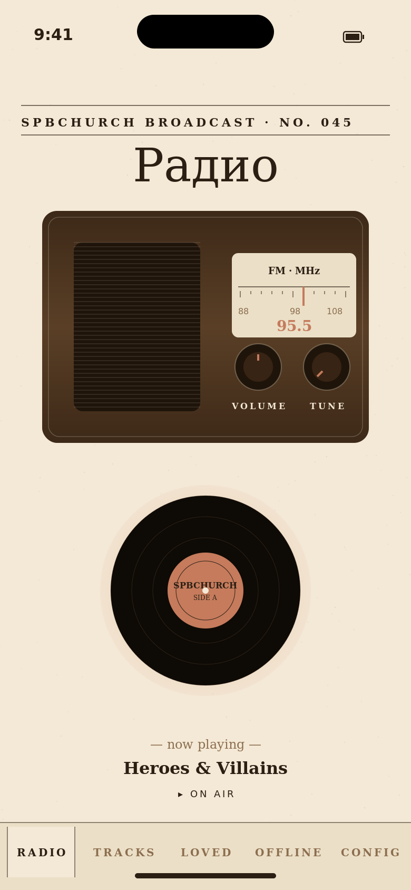
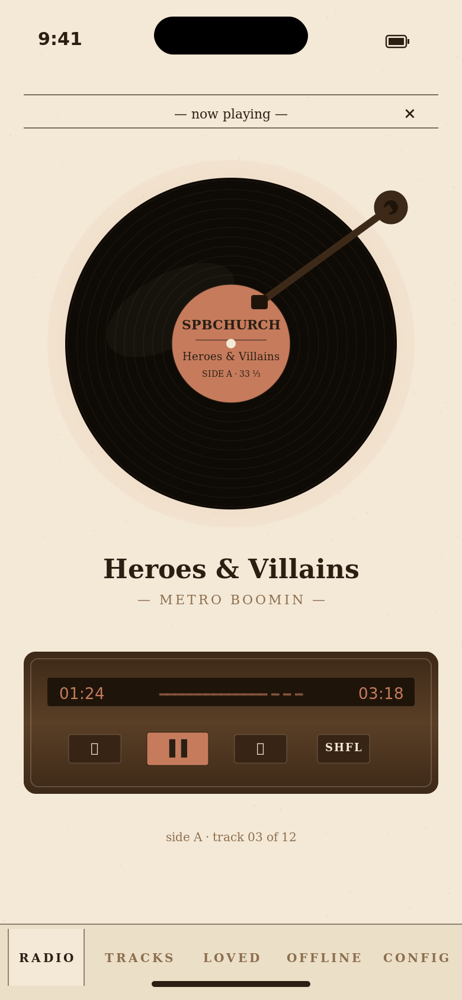
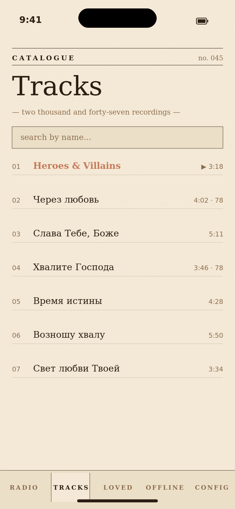
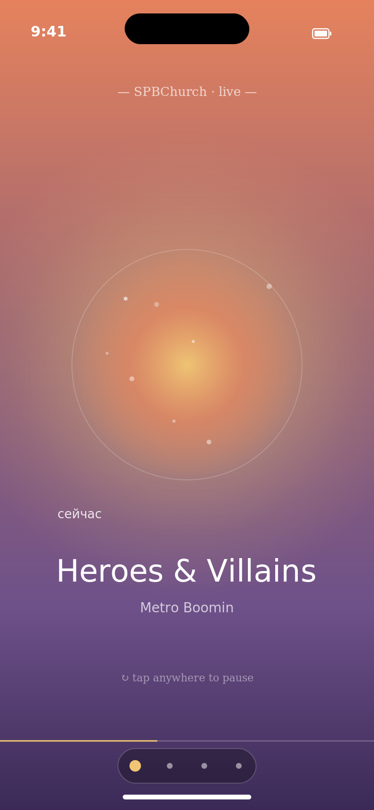
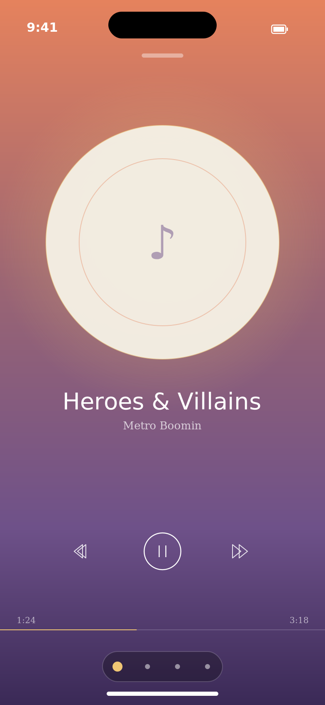
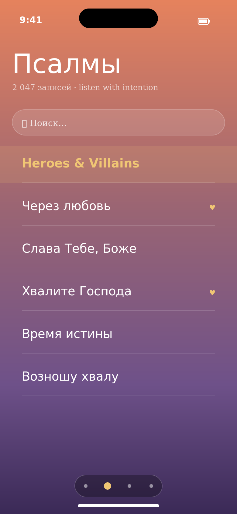
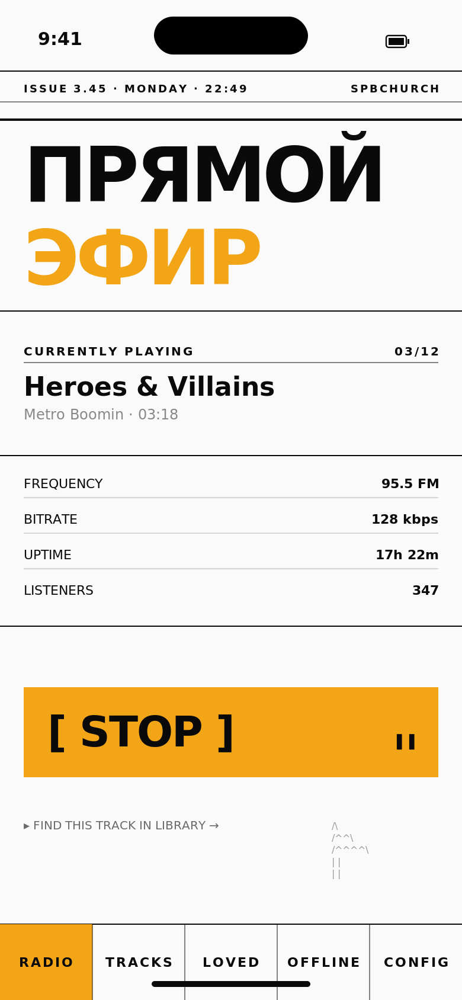
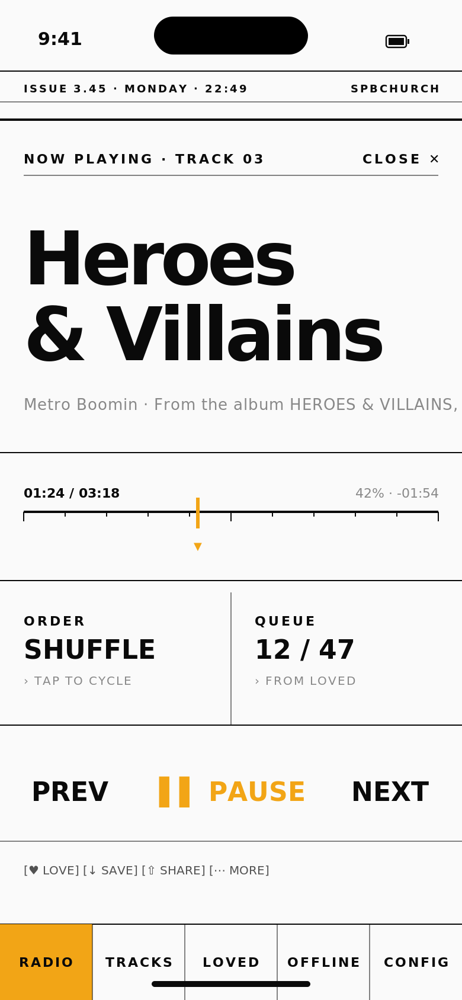
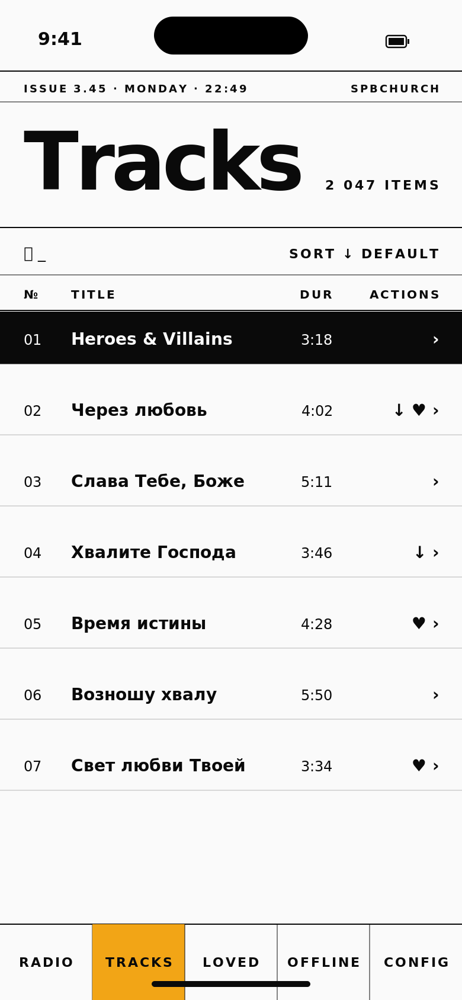

# Design Explorations · v5

Три радикально разных направления переработки UI для SPBChurch Radio. Главный принцип: каждый вариант — **отдельная ДНК**, а не вариация существующей. Любой из них меняет общее ощущение приложения, но сохраняет весь функционал v4.0.

В каждой папке — мокапы трёх ключевых экранов: **Радио**, **Плеер (Now Playing)**, **Треки**. Они показывают tone, типографику, плотность и навигационную модель.

> Это исследовательские мокапы для обсуждения. Они НЕ являются билд-готовым кодом — это направления, чтобы выбрать одно и проработать в SwiftUI.

---

## A · Vinyl — Retro Listening Room

> Тёплая комната с виниловым проигрывателем 70-х. Тактильно, ностальгично, осязаемо.

### Палитра

| | |
|---|---|
| Cream paper | `#F4E9D6` |
| Warm dark brown (ink) | `#2B1F14` |
| Wood grain | `#3D2918 → #5A3F26` |
| Dusty rose accent | `#C57B5C` |

### Типографика
- **Georgia (serif)** для display, italic для атмосферных подзаголовков
- **Menlo (monospace)** для таймкодов и метаданных
- High-contrast scale — крупные заголовки 44pt italic, мелкие caps `tracking: 3`

### Сигнатурные элементы
- **Винтажный приёмник** на радио-экране: speaker grille, шкала FM с делениями, два физических knob'а (Volume, Tune)
- **Вращающийся винил** в плеере с лейблом-обложкой и наклонным тонармом
- **Бумажная фактура** на фоне — subtle dot grain
- **Деревянная декка** транспорта с тёмными физическими кнопками
- Tab bar — **бумажные «корешки»** с serif caps, активная вкладка как «открытая страница»
- Каталог треков — **двух-колоночный list** с italic названиями и monospace длительностями

### Скриншоты

| Радио | Плеер | Треки |
|---|---|---|
|  |  |  |

### Сложность реализации
- **Средняя**: основная сложность — вращающийся винил с правильным physics-based easing, физические кнопки с pressed-состояниями, paper texture overlay (можно SwiftUI Canvas).
- Пользовательский SF Symbol set заменить на нарисованные SVG glyphs.

### Когда уместно
Если хочется, чтобы приложение было **запоминающимся, тёплым, ламповым**. Подходит для аудитории, которая ценит «материальность» — слушатели, которым важно ощущение «настоящей» радиостанции.

### Риски
- Может прочитаться как «винтажный китч», особенно молодёжью.
- Концепция винила может конфликтовать с духовной музыкой в восприятии части аудитории — пластинки 70-х имеют светский подтекст.

---

## B · Sanctuary — Worship & Contemplation

> Молитвенная тишина. Атмосферно, медитативно, минимально.

### Палитра — **time-of-day gradient**

Фон меняется в течение дня:

| Время | Градиент |
|---|---|
| Рассвет (5–9) | `#FFB088 → #6E5189` |
| День (9–17) | `#A8C8E5 → #F0E6D2` |
| **Закат (17–22)** ← в мокапе | `#E5825D → #6E5189 → #3B2A57` |
| Ночь (22–5) | `#1A1F3A → #6B4A7C` |

Акцент — золото `#F0C674`, для CTA и индикаторов состояния.

### Типографика
- **New York / Georgia (serif italic)** — основной display, увеличенный line-height
- Body — стандартный SF, но с щедрым leading
- Текст «дышит» — буквы плавают на фоне

### Сигнатурные элементы
- **Никакого UI шума.** Полноэкранный градиент.
- На радио-экране — **мягкий светящийся орб**, который пульсирует со звуком (audio-reactive в реале). Тап в любом месте = play.
- Метаданные «летают» вокруг орба маленьким текстом — как молитвенные слова.
- В плеере — обложка как **breathing circle**, текст ниже как поэтическая строка.
- **Никакого tab bar** — заменён на маленькую floating pill с 4 точками. Свайп влево/вправо переключает экраны.
- Транспорт — **очень тонкие линии (1pt)**, едва заметные, появляются при касании.
- Прогресс — тонкая линия по нижнему краю экрана.

### Скриншоты

| Радио | Плеер | Треки |
|---|---|---|
|  |  |  |

### Сложность реализации
- **Высокая**: time-of-day shifting gradient (легко через `Date` + interpolation), audio-reactive орб (нужен `AVAudioEngine` taps + Metal shader или `Canvas` с time-based animation), кастомная swipe-навигация вместо `TabView`.
- Самый необычный для SwiftUI — большая часть кастомизирована.

### Когда уместно
Самый честный ответ для **духовной музыки**. Создаёт связь с естественным ритмом дня, медитативной природой контента, освобождает экран от «офисного» UI. Идеально для прослушивания псалмов перед сном или утренней молитвы.

### Риски
- Может «исчезать» — слишком воздушно, пользователь не сразу поймёт где кнопки.
- Tab bar заменён на pill — придётся объяснить навигацию пользователю (onboarding tip).
- Audio-reactive орб — реальная техническая работа.

---

## C · Press — Editorial Brutalism

> Дизайн-журнал. Типография как первичный носитель. Очень осмысленно, контрастно, информативно.

### Палитра

| | |
|---|---|
| Paper | `#FAFAFA` |
| Ink | `#0A0A0A` |
| Saffron accent | `#F2A516` (или Kelly green `#3DAA48`) |
| Muted | `#888888` |

Никаких полутонов в фоне. Никаких теней. Только текст + линии + один акцент.

### Типографика
- **Helvetica/Inter Bold 900** для гигантских display (62–72pt) с `tracking: -3`
- **Menlo (monospace)** для всех числовых данных, таймкодов, метрик
- Caps + `tracking: 1.5–2` для UI-лейблов

### Сигнатурные элементы
- **0pt rounded corners** везде. Только прямые углы.
- Структурная **6-колоночная сетка**, разделители — `0.5–1pt` чёрные линии
- Радио — **title-page вёрстка**: «ПРЯМОЙ ЭФИР» гигантскими буквами, под ним data-table метаданных (Frequency, Bitrate, Uptime, Listeners), play/stop как **большая текстовая кнопка-блок** `[ STOP ]` залитая accent-цветом
- Плеер — **постер**: название трека fills the screen, scrubber с тиками как в DAW, transport как text-кнопки
- Треки — **настоящая таблица данных** (`№ | Title | Dur | Actions`), с column headers, current track инвертированной строкой (white-on-black)
- Bottom rail — текстовые caps-labels, разделённые вертикальными линиями: `RADIO · TRACKS · LOVED · OFFLINE · CONFIG`
- Каждый экран имеет **page header**: `ISSUE 3.45 · MONDAY · 22:49 · SPBCHURCH` — как в свежем номере газеты

### Скриншоты

| Радио | Плеер | Треки |
|---|---|---|
|  |  |  |

### Сложность реализации
- **Низкая**: вся «магия» — типография и линии. SwiftUI с этим справляется идеально через `Text` + `Divider` + правильно подобранные `Font.system`.
- Самый быстрый в реализации из трёх вариантов.

### Когда уместно
Если приложение хочется сделать **серьёзным, информационным, вдумчивым**. Подходит читателям, людям с любовью к печатному дизайну, тем кто ценит структуру и плотность данных. Sets a tone of editorial respect for the content.

### Риски
- Может казаться «холодным», слишком функциональным для эмоциональной аудио-среды.
- Большие font sizes могут быть проблемой для длинных русских заголовков (но `minimumScaleFactor` решает).
- Высокий контраст без мягких теней — некоторым тяжело глазам.

---

## Сравнительная таблица

| | A · Vinyl | B · Sanctuary | C · Press |
|---|---|---|---|
| **Настроение** | тёплое, ностальгическое | медитативное, духовное | острое, информативное |
| **Типографика** | Georgia italic + Menlo | New York serif | Helvetica Bold 900 + Menlo |
| **Акцент** | Dusty rose `#C57B5C` | Gold `#F0C674` | Saffron `#F2A516` |
| **Фон** | Cream paper с грейном | Time-of-day gradient | Чистый `#FAFAFA` |
| **Tab bar** | Paper «корешки» | Floating pill (нет таб-бара) | Bottom rail с текстом |
| **Сигнатурный элемент** | Винил + receiver | Светящийся орб | Гигантская типографика |
| **Сложность реализации** | средне | высоко | низко |
| **Подходит контенту** | **★★** прямой эфир | **★★★** псалмы, контемпляция | **★★** каталог, чтение |
| **Риск** | винтажный китч | UI «исчезает» | холодное ощущение |

---

## Мой топ-выбор

**B · Sanctuary** — самое подходящее для христианской музыки и псалмов. Time-of-day gradient — изящная связь с естественным ритмом молитвы (matins → vespers → night vigil). Audio-reactive орб создаёт ощущение **присутствия**, не симуляции UI. Самый смелый выбор, но даст наиболее уникальное приложение.

**Если нужно что-то быстрое и характерное** — **C · Press**. Реализуется за пару дней, выглядит самобытно, не похоже ни на одно музыкальное приложение в App Store.

**Если хочется тёплую story** — **A · Vinyl**. Запоминающееся приложение с физическими элементами, но требует точной анимации винила и тонармa.

---

Какой выбираешь? Или хочешь, чтобы я предложил гибрид (например Sanctuary для радио + Press для каталога)?
